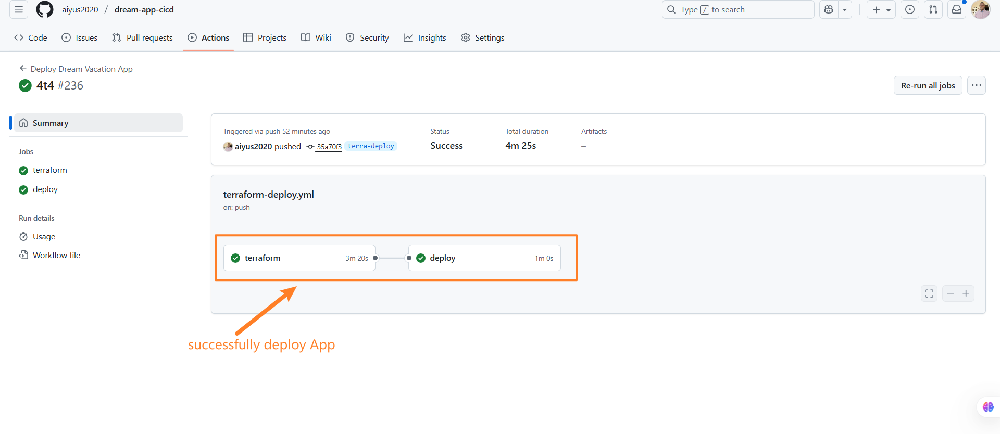
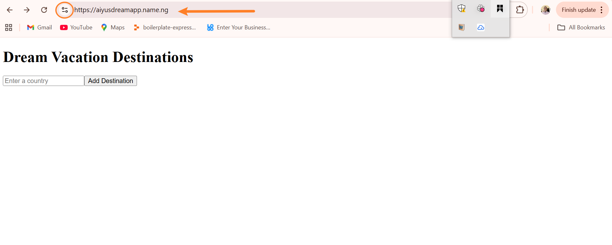

# Dream Vacation App — Infrastructure + Deployment

## 🌍 Overview
The **Dream Vacation App** is a full-stack project deployed on AWS using **Terraform** and **GitHub Actions** with a containerized setup.  
It uses **Traefik** as a reverse proxy to automatically manage HTTPS certificates with Let’s Encrypt, simplifying deployment.

The stack includes:
- **Frontend** (React or similar UI)
- **Backend API**
- **PostgreSQL database**
- **Traefik reverse proxy** with automatic SSL
- **GitHub Actions CI/CD** pipeline for automated provisioning & deployment
- **Terraform** for Infrastructure as Code (IaC)


---

## 🚀 Deployment Workflow

1. **Provision Infra with Terraform**
   - Creates VPC, subnets, security groups
   - Launches EC2 instance with required ports
   - Outputs EC2 IP

2. **GitHub Actions Pipeline**
   - Runs Terraform
   - Syncs app code to EC2
   - Installs Docker & Compose
   - Starts **Traefik + App services** via Docker Compose
   - Traefik automatically requests and renews SSL certificates via Let’s Encrypt

3. **Access Application**
   - App is available at `https://aiyusdreamapp.name.ng/`  
   - Traefik routes `/` → frontend and `/api` → backend

---

## 🛠️ Prerequisites

- AWS account + IAM credentials
- A domain (e.g. `yourdomain.com`) pointing to your EC2 instance
- GitHub repo with secrets:
  - `AWS_ACCESS_KEY_ID`, `AWS_SECRET_ACCESS_KEY`
  - `EC2_SSH_KEY` (private SSH key)
  - DB credentials
- Docker Hub repo for frontend & backend images

---

## 🔧 Setup

### 1. Infrastructure (Terraform)

```bash
cd terraform
terraform init
terraform apply -auto-approve
2. DNS Setup
Points your domain (your-domain) → EC2 public IP (Terraform output).

3. CI/CD Trigger
Push to terra-deploy branch or trigger workflow manually:

bash
Copy code
git push origin terra-deploy
GitHub Actions will:

Recreate EC2 instance (optional destroy/apply cycle)

Sync code to EC2

Deploy Docker Compose stack with Traefik

⚡ Local Development
Run containers locally:

bash
Copy code
docker compose up --build
Access:

Frontend: http://localhost:3000

Backend: http://localhost:8000

🔑 Environment Variables
Copy code
FRONTEND_TAG=<docker image tag>
BACKEND_TAG=<docker image tag>
POSTGRES_DB=<db name>
POSTGRES_USER=<db user>
POSTGRES_PASSWORD=<db password>
DOMAIN=yourdomain.com
EMAIL=youremail@example.com


👤 Maintainer
Aiyus — GitHub

```
## Screen shots
  
 

**Visit_site_here** `https://aiyusdreamapp.name.ng/`